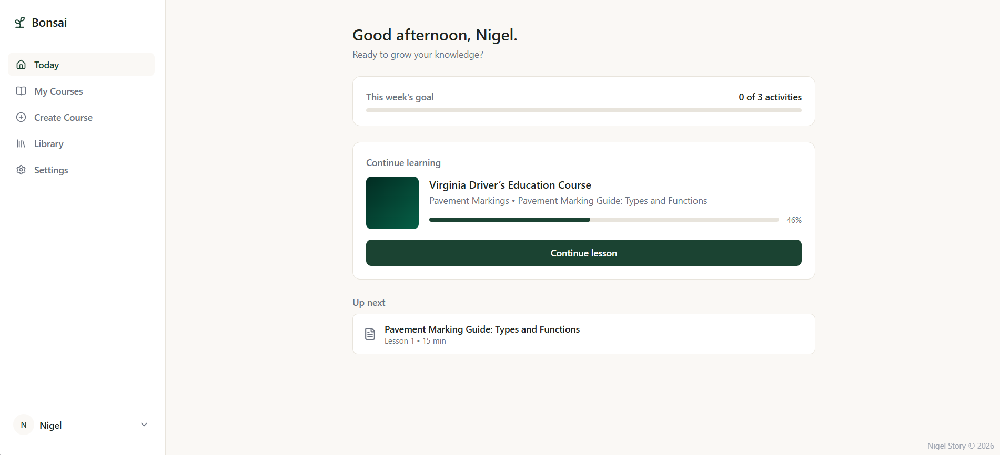
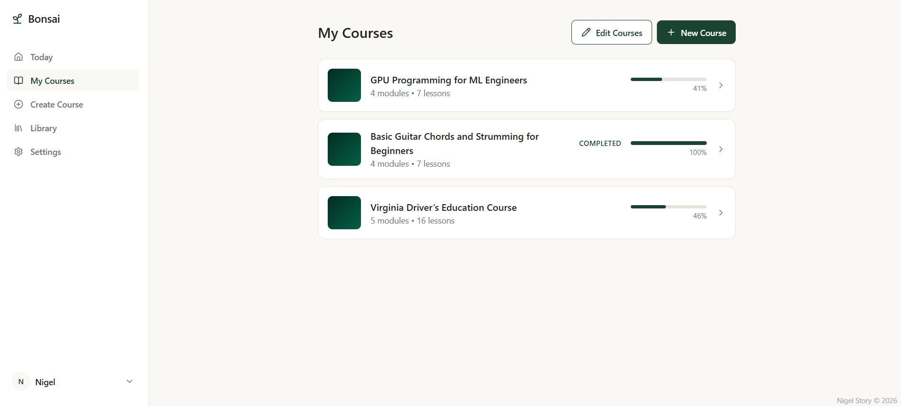
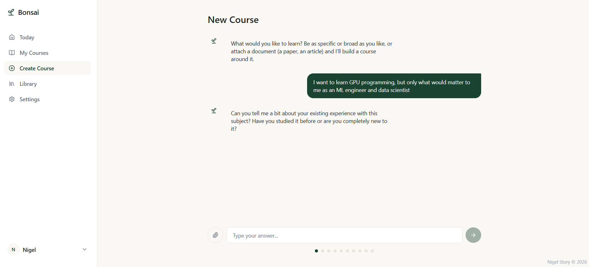

<h1> Bonsai Learning</h1>

An open-source, locally-hosted, self-guided AI learning platform for self-directed learning on any subject. See `docs/bonsai_initial_idea.md` for the product background, `bonsai_prd.md` for the full product requirements, and `design.md` for the current build's technical design.

**Status:** Phases 0 and 1 are complete, and Phase 2 is mostly done. Phase 1 stood up the real core loop end to end against a live Ollama instance: LLM-driven course creation, incremental per-module lesson generation with retrieval-grounded citations, quiz feedback, mid-course direction changes, and data export/import, all schema-validated so a malformed model response fails clearly instead of corrupting data. Phase 2 builds on that with a reworked chunk-and-embed retrieval pipeline (deterministic citations for both documents and web search), opt-in web search for document-grounded courses, illustrative images in readings, a "Keep going" path from a finished course, weekly activity goals, and generated course thumbnails. Only video embedding remains for Phase 2, and Phase 3 (polish, semantic search, AI evals, community readiness) hasn't started. See `bonsai_prd.md`'s Milestones and `design.md`'s Roadmap sections for full detail.

## Screenshots

**Today dashboard**, where you land. Shows an optional weekly learning-objective goal and a one-click way back into whatever you were last working through.



**My Courses**: every course in progress or completed, with real progress tracked per course.



**Course creation**: a free-text, LLM-driven interview (or an attached document) shapes the course before any outline is generated.



## Motivation
I love continuous learning, but I get tired of having to search through sites like Udemy or Coursera looking for courses, not finding exactly what I need, and then paying for a course that only loosely lines up with what I actually want to learn.

While laying in bed after searching for a good course on practical GPU programming for ML/AI engineers and not having any luck, I decided to ask Claude for advice. Is GPU programming worth learning? Where would it be best for an ML engineer to focus? What technology and programming languages would be involved? And finally, can you draft a course outline for me?

The outline drafted was very good -- it had a great structured approach with modules, timelines, practicum, and even a capstone project; but again, only the outline. The question then became how would I have Claude actually go about creating this course for me in an engaging, practical, and motivating way. If I could figure that out, I could have it teach me anything.

Recently, I've been on a bonsai kick on TikTok. The meditative patience that goes into creating and maintaining these seemingly ancient trees in miniature is fascinating to me: wiring shoots and cutting limbs, cleaning roots, repotting -- all with patient goal of creating something beautiful. That's the experience I want from this learning platform: a self-guided, self-built program of learning where the student has the ability to reshape the curriculum as they go through AI. The fact that Bonsai has "AI" in its name is just a fun coincidence.

## Prerequisites

- Docker and Docker Compose (easiest way to run both servers together), **or**
- Node.js 20+ and npm (for `frontend/`) and Python 3.10+ (for `backend/`), to run them natively
- If using BYOM (bring-your-own-model) with a local Ollama instance: **Ollama >=0.5 is required, not
  just recommended**. Generation constrains every LLM response to an exact JSON schema (see
  `app/services/llm.py`'s `complete()`), which needs Ollama's schema-constrained decoding — added in
  0.5. Older versions don't degrade gracefully: they reject the request outright (`400 Bad Request`,
  `"cannot unmarshal object into Go struct field ChatRequest.format of type string"`), since `format`
  used to only accept the literal string `"json"`, not a schema object. Check with `ollama --version`;
  upgrade with the same install script used to install it (`curl -fsSL https://ollama.com/install.sh | sh`).

## Project structure

```
bonsai/
├── docs/               # idea doc, mockup, feedback docs, course-creation flow design notes
├── bonsai_prd.md       # product requirements document
├── design.md           # design document: Phase 0, plus a build-slice-by-build-slice Phase 1 section
├── docker-compose.yml  # runs frontend + backend together, each in its own container
├── frontend/           # React + TypeScript + Vite + Tailwind SPA
│   └── Dockerfile
└── backend/            # Flask app: persistence, LiteLLM wrapper, REST routes
    ├── Dockerfile
    ├── app/
    │   ├── models.py            # Course, Module, Activity, SourceMaterial, UserSettings, ConversationMessage
    │   ├── prompts/              # LLM prompts as markdown files, kept out of code for clean versioning
    │   ├── services/
    │   │   ├── llm.py                     # LiteLLM wrapper: schema-constrained decoding, mocked in test mode
    │   │   ├── llm_schemas.py             # Pydantic schemas validating (and shaping) LLM JSON output
    │   │   ├── model_selection.py         # UserSettings -> model/api_key/api_base for complete()
    │   │   ├── prompts.py                 # loads app/prompts/*.md, fills in ${variables}
    │   │   ├── content_storage.py         # saves/loads an activity's generated content to/from disk
    │   │   ├── source_material_storage.py # saves/loads an uploaded document's extracted text
    │   │   ├── document_extraction.py     # .txt/.docx/.pdf -> page-tagged plain text, for course-grounding uploads
    │   │   ├── document_chunking.py       # splits extracted pages into overlapping, page-bounded retrieval chunks
    │   │   ├── embedding.py               # LiteLLM/Ollama embedding wrapper, mocked in test mode
    │   │   ├── image_generation.py        # LiteLLM image generation wrapper (course thumbnails), mocked in test mode
    │   │   ├── thumbnail_storage.py       # saves/loads a generated course thumbnail image to/from disk
    │   │   ├── vector_store.py            # per-course FAISS index: chunk storage, retrieval, and ranking
    │   │   ├── retrieval.py               # Tavily web search + page fetch, mocked in test mode
    │   │   ├── retrieval_agent.py         # unused model-driven tool-calling loop, kept for a possible future Q&A feature
    │   │   ├── course_context.py          # compacted course memory + real conversation-turn assembly, shared by every prompt
    │   │   ├── course_generation.py       # interview -> outline -> approve; deletion; "Branch Off"/"Change This Course"
    │   │   ├── module_generation.py       # generates a module's activities on demand, sequentially, retrieval- or document-grounded
    │   │   ├── module_retrieval.py        # deliberate per-activity search planning + retrieval before any content is written
    │   │   └── data_export.py             # full-data export/import as a portable .zip archive
    │   └── routes/               # health, courses, settings, activities, course_creation, modules, data
    ├── migrations/          # Flask-Migrate / Alembic schema migrations
    └── tests/               # pytest suite
```

## Running with Docker Compose

The quickest way to get both servers running together:

```
docker compose up --build
```

This builds a container for each of `frontend/` and `backend/`, applies database migrations and seeds example courses automatically, and starts both dev servers with hot reload (your local `frontend/` and `backend/` directories are mounted into the containers, so code edits take effect immediately, same as running natively). Visit `http://localhost:5173` for the app; the backend is reachable at `http://localhost:5000`. `instance/bonsai.db` and generated module content land in `backend/instance/` on your host machine, same as running the backend natively, so your data survives `docker compose down`.

By default this makes real LiteLLM calls (a provider API key needs to be configured through Settings once the app is up). To run in test mode instead (mocked LLM calls, no API costs):

```
BONSAI_TEST_MODE=true docker compose up --build
```

Skip `--build` on subsequent runs unless you've changed a `Dockerfile` or a dependency file (`requirements.txt`, `package.json`).

## Running the frontend natively

```
cd frontend
npm install
npm run dev
```

Visit the URL Vite prints (defaults to `http://localhost:5173`).

## Running the backend natively

```
cd backend
python -m venv venv          # already created if you're continuing this session
source venv/bin/activate
pip install -r requirements.txt
flask db upgrade             # creates instance/bonsai.db from the latest migration
python seed.py                # inserts example courses if the database is empty
python run.py
```

By default this makes real LiteLLM calls, which needs a provider API key configured through Settings (or a local Ollama endpoint for BYOM — see the Prerequisites section above for the minimum Ollama version). To run without one, and avoid API costs entirely during development, use test mode instead, which returns canned responses for every LLM call while still using your real, persistent database:

```
BONSAI_TEST_MODE=true python run.py
```

Endpoints that exist now:

```
curl http://localhost:5000/api/health
# {"status": "ok"}

curl http://localhost:5000/api/courses
# [] (or the seeded example courses, if you ran seed.py)

curl http://localhost:5000/api/settings
# {"name": "Learner", "feedbackTone": "encouraging", ...}

curl -X POST http://localhost:5000/api/activities/<activity-id>/complete
# the full parent course, with that activity (and the next one it unlocks) updated

curl -X POST http://localhost:5000/api/courses -d '{"message": "I want to learn woodworking"}'
# {"courseId": "...", "done": false, "question": "..."}
# then POST .../interview-messages, .../generate-outline, .../outline-feedback, .../approve-outline
# (add a "parentCourseId" field to any of these to "Branch Off" from another course instead of
# starting fresh — the interview/outline are then shaped by what that course already covered)

curl -X DELETE http://localhost:5000/api/courses/<course-id>
# deletes the course and everything generated in it, including its on-disk content files

curl -X POST http://localhost:5000/api/modules/<module-id>/generate-activities
# the full parent course, with that module's activities generated (idempotent: a
# module that already has activities is returned unchanged)

curl -X POST http://localhost:5000/api/modules/<module-id>/direction-interview -d '{"message": "..."}'
# {"done": false, "question": "..."}, the "Change This Course" mid-course check-in — same shape as
# course creation's interview, then POST .../direction-interview-messages, .../direction-outline,
# .../direction-outline-feedback, .../direction-outline-approve (replaces everything not yet reached
# in this same course; nothing already completed is touched)

curl http://localhost:5000/api/data/export -o bonsai-export.zip
# a portable archive: every course/module/activity/source-material/settings row plus their on-disk
# content files, as JSON + the real files, zipped together. API keys are never included.

curl -X POST http://localhost:5000/api/data/import -F file=@bonsai-export.zip
# restores from a previously exported archive — replaces all current courses/progress with what's in
# the archive; API keys already configured on this installation are left untouched
```

## Running the backend tests

```
cd backend
source venv/bin/activate
pip install -r requirements-dev.txt
python -m pytest -v
```

The suite always runs in test mode (mocked LLM calls, an in-memory database), so it never needs an API key or touches `instance/bonsai.db`.

## Backend database migrations

Schema changes go through Flask-Migrate:

```
cd backend
export FLASK_APP=run.py
flask db migrate -m "describe the change"
flask db upgrade
```

The frontend fetches courses and settings from the backend on load (see `frontend/src/lib/api.ts`), and creating a course through the app now runs the real interview -> outline -> approve flow. Run both servers together, with the backend seeded, to see it end to end. Reaching an in-progress module with no activities yet (e.g. a freshly-approved course, or one of the seeded example courses) triggers real lesson-content generation automatically; `CourseHome.tsx` shows "Generating..." until it lands.
