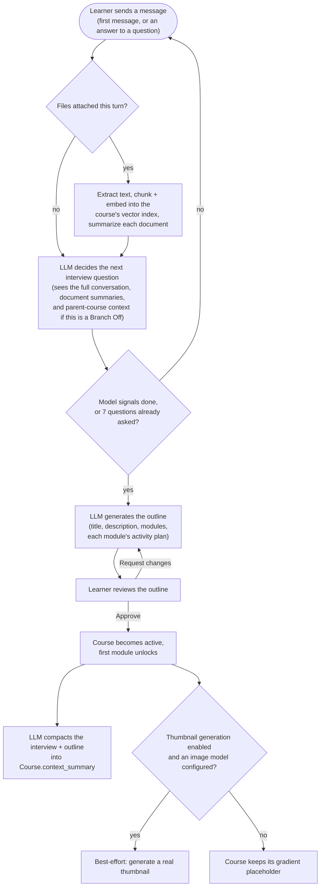

# Process flows: course creation & module generation

These diagrams reflect the actual current implementation, not a plan. `course_creation_websearch_flow.md` in this same folder was the original planning doc for module generation's search/retrieval design; a lot has changed since (the RAG chunk-and-embed pipeline, document grounding, video embedding), so treat that file as history and this one as current.

Branch Off and Change This Course aren't diagrammed separately below — both reuse the same interview → outline mechanism shown in Course Creation, just scoped to a module's remaining course instead of a brand new one, and seeded with the parent/prior course's compacted context instead of starting blank.

## Course creation

**Where this lives in code** (`backend/app/services/course_generation.py` unless noted): the loop is `start_course()`/`submit_interview_answer()` → `_ingest_source_materials()` → `_advance_interview()` → `_next_interview_step()`; the outline step is `generate_outline()`/`submit_outline_feedback()` → `_generate_outline_content()` → `_apply_outline()`; approval is `approve_outline()`, which also calls `compact_course_context()` (`course_context.py`) and the best-effort `_generate_thumbnail_if_enabled()`.

## Module generation

Runs lazily, the first time a learner reaches a module with no activities yet — not at outline time.

```mermaid
flowchart TD
    Trigger(["Learner reaches an in-progress module<br/>with zero activities"]) --> Call["POST /modules/&lt;id&gt;/generate-activities"]
    Call --> Idempotent{"Module already has activities?"}
    Idempotent -- "yes" --> Return["Return unchanged"]
    Idempotent -- "no" --> Resolve["Resolve the completion model,<br/>embedding model, and settings"]

    subgraph grounding["Grounding — decide what material each activity draws on"]
        Resolve --> NeedsPlan{"Web-grounded or supplemented,<br/>or video embedding enabled?"}
        NeedsPlan -- "yes" --> SearchPlan["LLM plans per-activity search terms,<br/>plus a video query + position"]
        NeedsPlan -- "no" --> VectorCheck
        SearchPlan --> WebBranch{"Web-grounded, or<br/>web-search-supplemented?"}
        WebBranch -- "yes" --> Tavily["Tavily search, per activity"]
        Tavily --> EmbedCheck{"Embedding model configured?"}
        EmbedCheck -- "yes" --> ChunkWeb["Chunk + embed results into<br/>the course's vector index"]
        EmbedCheck -- "no" --> RawWeb["Ground each activity on its<br/>raw fetched results directly"]
        WebBranch -- "no" --> VectorCheck
        ChunkWeb --> VectorCheck{"Course has a usable vector index<br/>(document, web, or both)?"}
        VectorCheck -- "yes" --> ChunkRetrieve["Per activity: embed its title + plan<br/>as the query, retrieve top matching chunks"]
        VectorCheck -- "no" --> RawFallback["Fall back to raw source-material<br/>text, or no grounding at all"]
    end

    subgraph video["Video embedding — best-effort, independent of grounding source"]
        ChunkRetrieve --> VideoGate
        RawFallback --> VideoGate
        RawWeb --> VideoGate{"Toggle + Tavily key on,<br/>and a video query was suggested?"}
        VideoGate -- "yes" --> VideoSearch["Tavily video search,<br/>filter to real YouTube video ids"]
        VideoSearch --> VideoSelect["LLM picks the best candidate,<br/>writes a caption"]
        VideoSelect --> VideoGood{"A good match found?"}
        VideoGood -- "yes" --> VideoSpec["Build a video activity,<br/>at its clamped position"]
        VideoGate -- "no" --> Sequential
        VideoGood -- "no" --> Sequential
        VideoSpec --> Sequential
    end

    subgraph generation["Sequential per-activity generation"]
        Sequential["Take the next planned activity, in order"] --> Turn["Build this activity's turn:<br/>its plan + any retrieved material"]
        Turn --> GenLLM["LLM generates this activity's content,<br/>as one running chat history"]
        GenLLM --> ReadingCheck{"Is this a reading?"}
        ReadingCheck -- "yes" --> Citations["Attach citations deterministically,<br/>from the chunks actually retrieved"]
        Citations --> VisualAidsGate{"Visual aids enabled<br/>and a Tavily key set?"}
        VisualAidsGate -- "yes" --> Aids["LLM flags spots for an image,<br/>Tavily image search, splice into the body"]
        VisualAidsGate -- "no" --> MoreLeft
        Aids --> MoreLeft{"More activities left?"}
        ReadingCheck -- "no" --> MoreLeft
        MoreLeft -- "yes" --> Sequential
    end

    MoreLeft -- "no" --> Persist["Merge generated activities + the video<br/>activity, if any, into final order"]
    Persist --> Save["Persist Activity rows + content files"]
    Save --> Digest["LLM generates a module digest,<br/>saved to feed later modules' context"]
```

**Where this lives in code** (`backend/app/services/module_generation.py` unless noted): the entry point is `generate_module_activities()`, which calls `_generate_activities_content()` — that function's own `needs_search_plan` check, web branch, and vector-index branch are exactly the `grounding` subgraph above (`plan_activity_searches()`/`retrieve_for_module()` in `module_retrieval.py`, `build_or_update_index()`/`query()` in `vector_store.py`). The `video` subgraph is `_maybe_build_video_spec()`/`_select_video()` (`video_search()`/`extract_youtube_video_id()` in `retrieval.py`). The `generation` subgraph is the per-activity loop inside `_generate_activities_content()` (`_activity_turn_message()`, `_add_visual_aids()`). Persistence and the digest are back in `generate_module_activities()` (`_generated_to_spec()`, `_ActivitySpec`) and `_generate_and_persist_digest()`.
